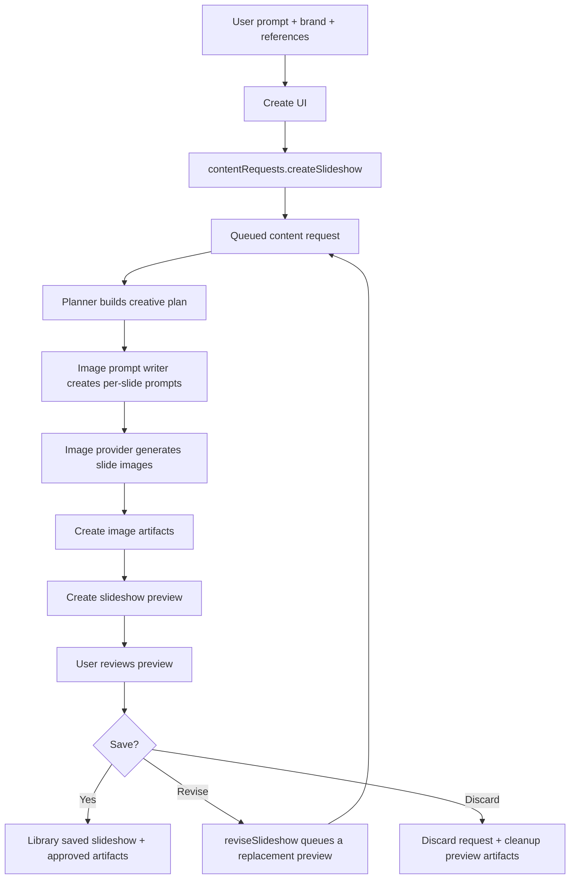
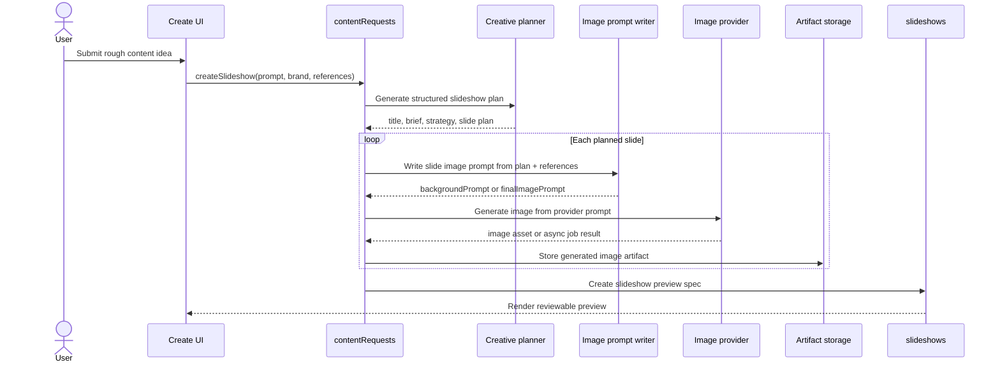
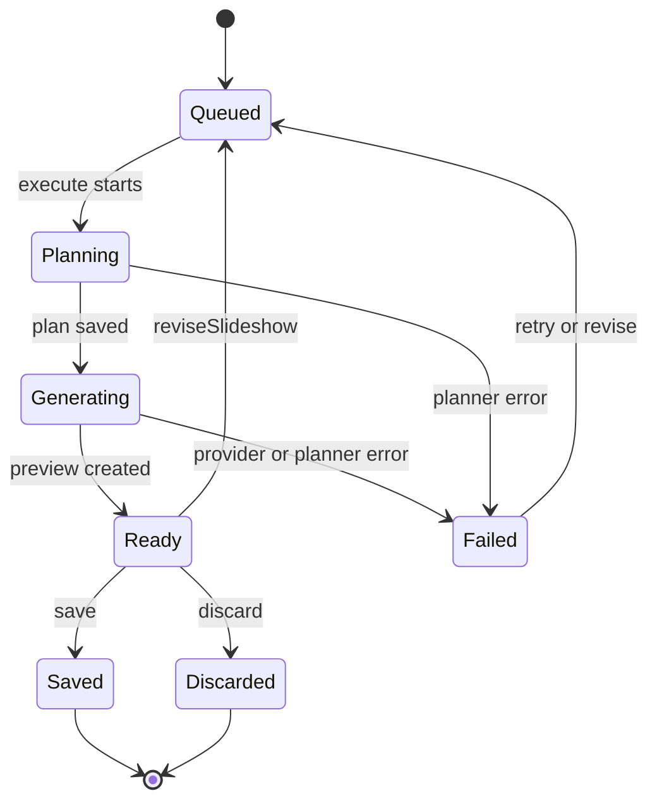
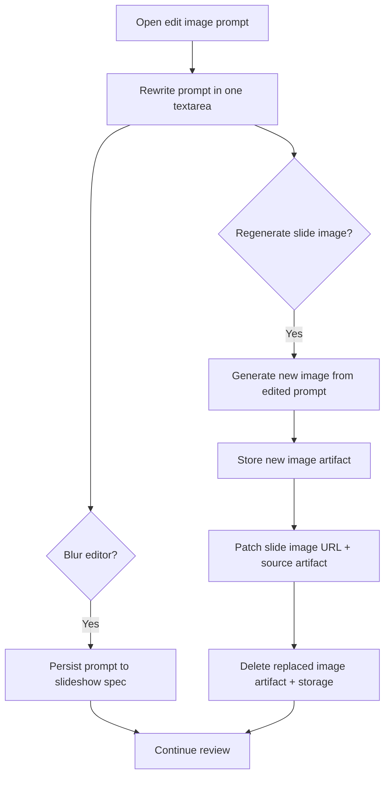
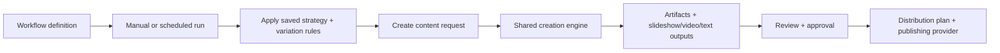

# Workflow Diagrams

Mermaid diagrams are text-based diagrams that render from Markdown. GitHub supports Mermaid in fenced code blocks, which makes these diagrams reviewable in PRs and easy to keep close to the code they describe.

Use this file as the living map for workflow and prompt-chain behavior. When the implementation changes, update the matching diagram in the same PR.

## Mermaid Conventions

- Use Mermaid for flows that are easier to understand visually than as prose.
- Prefer `flowchart` for product/workflow stages, `sequenceDiagram` for prompt/provider chains, and `stateDiagram-v2` for lifecycle/status transitions.
- Keep node labels short. Put implementation details in prose immediately above or below the diagram.
- Use stable system nouns: `Create UI`, `contentRequests`, `Planner`, `Image prompt writer`, `Image provider`, `artifacts`, and `slideshows`.
- Avoid lower-case `end` as a node label because Mermaid treats it as syntax.
- Use quoted labels when text contains punctuation.

## Create Slideshow Workflow

This is the high-level path for a one-off slideshow from the Create page. The content request is the job record; artifacts and slideshows are the durable outputs.

## Prompt Chain

This sequence diagram shows the current prompt chain for a Create slideshow request. The planner produces the structured plan first; the per-slide prompt writer then produces image-generation prompts using that plan.

## Content Request Status

The request status is the user-visible lifecycle for one-off creation. It also gives the UI enough information to show loading, preview, saved, failed, or discarded states.

## Slide Image Prompt Editing

The Create preview supports editing the prompt for a single slide. Blurring the prompt editor persists prompt text only; regenerating creates a replacement image and removes the old slide image artifact.

## Future Workflow Wrapper

Workflows should eventually wrap the same content creation engine instead of becoming a separate generation stack. This diagram is the intended direction, not necessarily the full current implementation.

## References

- Mermaid docs: https://mermaid.js.org/intro/
- Mermaid flowchart syntax: https://mermaid.js.org/syntax/flowchart.html
- Mermaid sequence syntax: https://mermaid.js.org/syntax/sequenceDiagram.html
- GitHub Mermaid rendering: https://docs.github.com/en/get-started/writing-on-github/working-with-advanced-formatting/creating-diagrams
